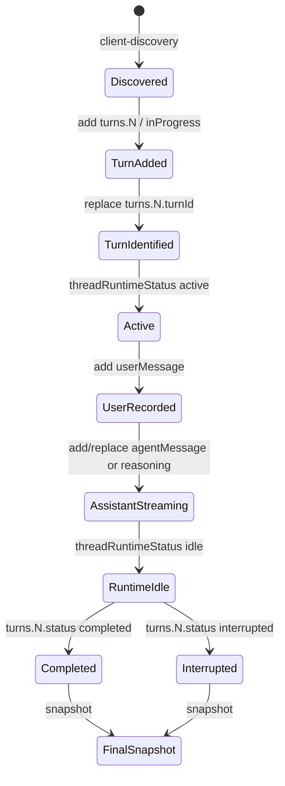

# Codex IPC 捕获数据分析

日期：2026-06-09

数据来源：`ipc-data/*.jsonl`

## 结论摘要

这批捕获数据里，Codex 会话生命周期主要不是通过显式的 `request` 帧暴露出来，而是通过 `broadcast / thread-stream-state-changed` 广播会话状态。每条广播携带 `params.conversationId`、`hostId` 和 `change`，其中 `change` 分两类：

- `snapshot`：完整 `conversationState`。
- `patches`：带 `baseRevision`、`revision` 和 JSON Patch 风格 `patches[]` 的增量状态变更。

新会话启动和继续会话在状态层的差异很小：二者都是向同一个 `turns` 数组追加一个 `inProgress` turn。新会话的关键特征是 `baseRevision: 0` 且追加 `turns.0`；继续会话则是在已有 `conversationId` 下追加 `turns.1`、`turns.2` 等后续 turn。

参数调节通过替换 `latestThreadSettings`、`latestModel`、`latestReasoningEffort`、`latestCollaborationMode` 等字段体现。第一批捕获里能看到模型从 `gpt-5.5` 切到 `gpt-5.4`，以及 reasoning effort 被设置为 `high`；后续 “插件访问 owner” 捕获进一步补上了 `high -> medium -> high` 的思考深度变化。

强制终止没有在这批数据里捕获到显式的 interrupt request，只捕获到了结果状态：`threadRuntimeStatus` 先变为 `idle`，随后当前 turn 的 `status` 从 `inProgress` 变为 `interrupted`，并写入 `durationMs`。中断后的 turn 没有 `error`，已产生的 `reasoning` 和 `commentary` 消息会保留在 `items` 里。

## 捕获文件概览

| 文件 | 场景 | 主 conversationId | 关键现象 |
| --- | --- | --- | --- |
| `新对话-从0开始的对话-codex-ipc-2026-06-09T07-38-12-055Z.jsonl` | 新建/首次发送 | `019eab50-5e5b-78c1-b5fe-9ebdd292cc01` | `r0->1` 追加 `turns.0` |
| `继续会话捕获-codex-ipc-2026-06-09T07-40-08-371Z.jsonl` | 继续发送第二轮 | `019eab50-5e5b-78c1-b5fe-9ebdd292cc01` | `r20->21` 追加 `turns.1` |
| `继续会话2-带代码块样式-codex-ipc-2026-06-09T07-41-39-706Z.jsonl` | 继续发送第三轮 | `019eab50-5e5b-78c1-b5fe-9ebdd292cc01` | `r40->41` 追加 `turns.2`，assistant 文本多次 replace 流式更新 |
| `会话强行终止中断-codex-ipc-2026-06-09T07-43-10-645Z.jsonl` | 第四轮被强制中断 | `019eab50-5e5b-78c1-b5fe-9ebdd292cc01` | `turns.3.status = interrupted` |
| `模型切换-思考深度切换捕获-codex-ipc-2026-06-09T07-35-09-502Z.jsonl` | 参数切换 | `019eaa7c-1826-7202-bb0c-70f2bfc4b1a7` | `latestThreadSettings`、`latestModel`、`latestCollaborationMode` 被替换 |
| `继续会话观察3-从插件访问owner-codex-ipc-2026-06-09T08-48-53-089Z.jsonl` | VSCode 插件继续 App owner 会话 | `019eab90-b721-7000-a4a9-ca0dcebe7c78` | 从已有 snapshot 开始，追加 `turns.1` |
| `模型切换-参数修改-插件访问-codex-ipc-2026-06-09T08-49-58-210Z.jsonl` | VSCode 插件修改 App owner 参数 | `019eab90-b721-7000-a4a9-ca0dcebe7c78` | `medium -> high`，`gpt-5.5 -> gpt-5.4` |

同一份捕获里可能混有另一个会话的 `gitInfo` 更新，例如 `019eaa7c-1826-7202-bb0c-70f2bfc4b1a7`。分析会话生命周期时，应优先按 `conversationId` 过滤，并把仅更新 `gitInfo` 的广播视为环境噪声。

## IPC 帧与字段

样本中观察到的消息类型：

| 类型 | 方向 | 作用 |
| --- | --- | --- |
| `client-discovery-request` | IPC -> monitor | Codex owner 探测当前客户端是否能处理某类请求，样本里内嵌 `ide-context` 请求和 `workspaceRoot`。 |
| `client-discovery-response` | monitor -> IPC | 捕获器返回 `{"canHandle": false}`，表示只旁路监听，不接管 owner 职责。 |
| `broadcast / thread-stream-state-changed` | IPC -> monitor | 核心会话状态广播。 |
| `broadcast / thread-read-state-changed` | IPC -> monitor | 会话完成后同步已读状态，例如 `hasUnreadTurn: false`。 |
| `broadcast / query-cache-invalidate` | IPC -> monitor | UI/global state cache 失效通知，和 turn 生命周期关系不大。 |

核心广播结构：

```json
{
  "type": "broadcast",
  "method": "thread-stream-state-changed",
  "sourceClientId": "...",
  "params": {
    "conversationId": "...",
    "hostId": "local",
    "change": {
      "type": "patches",
      "baseRevision": 20,
      "revision": 21,
      "patches": []
    },
    "version": 7,
    "type": "thread-stream-state-changed"
  },
  "version": 7
}
```

`revision` 是恢复状态的顺序依据。客户端应按同一 `conversationId` 维护本地状态：遇到 `snapshot` 直接替换状态，遇到 `patches` 则按顺序应用到上一个状态。

## 会话启动

新会话样本的核心序列如下：

| 事件 id | revision | 变更 | 含义 |
| --- | --- | --- | --- |
| 39/40 | - | discovery request/response | 捕获器被探测，返回 `canHandle: false`。 |
| 42 | `0->1` | `add turns.0` | 创建首个 turn，状态为 `inProgress`。 |
| 43 | `2` | `snapshot` | 给出完整 `conversationState`。 |
| 44 | `2->3` | `replace turns.0.turnId` | owner 生成真实 `turnId`。 |
| 45 | `3->4` | `replace latestThreadSettings/latestReasoningEffort/latestCollaborationMode` | 固化本轮有效模型、推理深度、权限等设置。 |
| 47 | `4->5` | `replace title` | 自动生成标题。 |
| 48 | `5->6` | `add threadRuntimeStatus: active` | 会话进入运行态。 |
| 49 | `6->7` | `add turns.0.hookRuns`、`replace requests: []` | 初始化 hooks 和待处理 request 列表。 |
| 51 | `8->9` | `add turns.0.items.0 userMessage` | 用户消息进入 turn items。 |
| 52-55 | `9->13` | `agentMessage final_answer` 多次更新 | assistant 文本以 replace 方式流式增长。 |
| 56 | `13->14` | `replace latestTokenUsageInfo` | 写入 token 信息。 |
| 57 | `14->15` | `replace threadRuntimeStatus: idle` | 运行结束。 |
| 58 | `15->16` | `replace turns.0.status: completed`、`durationMs` | turn 完成。 |
| 60 | `18` | `snapshot` | 完成态快照。 |
| 61 | - | `thread-read-state-changed` | 同步已读状态。 |

首个 turn 的 `params` 很关键：

```json
{
  "threadId": "019eab50-5e5b-78c1-b5fe-9ebdd292cc01",
  "cwd": "D:\\bid-project\\AgentPlatform",
  "approvalPolicy": "never",
  "approvalsReviewer": "user",
  "sandboxPolicy": { "type": "dangerFullAccess" },
  "model": null,
  "serviceTier": null,
  "effort": null,
  "input": [{ "type": "text", "text": "你好\n", "text_elements": [] }],
  "attachments": [],
  "commentAttachments": [],
  "collaborationMode": {
    "mode": "default",
    "settings": {
      "model": "gpt-5.5",
      "reasoning_effort": "high",
      "developer_instructions": null
    }
  },
  "summary": "none",
  "personality": "friendly",
  "outputSchema": null
}
```

注意：`params.model` 和 `params.effort` 在这些 turn 里常为 `null`，但 `collaborationMode.settings.model` 与 `collaborationMode.settings.reasoning_effort` 已携带有效设置。随后 `latestThreadSettings` 会补齐 `modelProvider`、`serviceTier`、`effort`、`personality` 等完整配置。

## 会话继续

继续会话不是创建新的 `conversationId`，而是在原 conversation 的 `turns` 数组中追加新 turn。

第二轮样本：

```text
r20->21 add turns.1
input: 请问你是什么模型？
collaborationMode.settings: gpt-5.5 / high
r21->22 replace turns.1.turnId
r23->24 replace threadRuntimeStatus: active
r26->27 add turns.1.items.0 userMessage
r27->31 add/replace turns.1.items.1 agentMessage final_answer
r32->33 replace threadRuntimeStatus: idle
r33->34 replace turns.1.status: completed
```

第三轮样本：

```text
r40->41 add turns.2
input: 请问python是什么？
r42->44 runtime active
r47->59 agentMessage final_answer 多次 replace 文本
r54->55 runtime idle
r59->60 turns.2.status = completed
```

继续会话的判断规则：

- `conversationId` 与历史会话相同。
- `turns.N` 中 `N > 0`。
- `baseRevision` 不是 0，而是沿用该会话已有 revision。
- 完成态 snapshot 里的 `turns.length` 会递增，例如 1、2、3、4。
- `latestTokenUsageInfo.total.totalTokens` 随 turn 累计增长：首轮 `15758`，第二轮 `31548`，第三轮 `47469`，中断第四轮后 `63650`。

Markdown/代码块样式不会产生特殊 IPC item 类型；它仍是 `agentMessage.text` 字符串的多次 replace，渲染代码块是 UI 层行为。

## 参数调节

参数调节样本的主会话是 `019eaa7c-1826-7202-bb0c-70f2bfc4b1a7`。捕获到的关键 patch：

```text
r1803->1804
replace latestThreadSettings: model=gpt-5.5 effort=high serviceTier=default
replace latestReasoningEffort: high
replace latestCollaborationMode: model=gpt-5.5 reasoning_effort=high mode=default

r1805->1806
replace latestThreadSettings: model=gpt-5.4 effort=high serviceTier=default
replace latestModel: gpt-5.4
replace latestCollaborationMode: model=gpt-5.4 reasoning_effort=high mode=default
replace previousTurnModel: gpt-5.5
```

有效参数主要分布在这些字段：

| 字段 | 含义 |
| --- | --- |
| `latestThreadSettings.model` | 当前 thread 设置里的模型。 |
| `latestModel` | UI/状态摘要里的最新模型。 |
| `previousTurnModel` | 切换前模型，用于记录上一次 turn 或上一次设置。 |
| `latestThreadSettings.effort` | 当前 thread 设置里的 reasoning effort。 |
| `latestReasoningEffort` | UI/状态摘要里的最新 reasoning effort。 |
| `latestCollaborationMode.settings.model` | collaboration mode 内嵌模型。 |
| `latestCollaborationMode.settings.reasoning_effort` | collaboration mode 内嵌 reasoning effort。 |
| `latestThreadSettings.approvalPolicy` | 审批策略。 |
| `latestThreadSettings.sandboxPolicy.type` | 沙箱策略，例如 `dangerFullAccess`。 |

样本中出现了重复的 `latestThreadSettings/latestCollaborationMode` replace，且值不变。这更像 owner/UI 对设置状态的重复同步或去抖后回写，不应被当成新的用户操作。

结合本仓库 `server/codex_server/control_service.py` 的实现，如果要主动同步模型和思考深度，已有代码使用的 IPC request 方法是：

```text
thread-follower-set-model-and-reasoning
```

发送新 turn 时使用：

```text
thread-follower-start-turn
```

不过这两个主动 request 没有出现在本次 `ipc-data` 捕获文件中；本次捕获只能直接证明 owner 广播出的状态变化。

## 补充：VSCode 插件访问 Codex App owner

新增两份捕获都围绕同一个会话：

```text
conversationId = 019eab90-b721-7000-a4a9-ca0dcebe7c78
sourceClientId = 912e51d3-e1ce-407b-bb78-7bfafabd5d14
```

这两份文件仍然没有捕获到显式 `request/response` 帧，只有 owner 广播出的状态变化。因此能直接确认的是 “请求已被 owner 接收并执行后的状态结果”，不能仅凭这两份 JSONL 还原 VSCode 插件发出的原始 request body。如果 `912e51d3-...` 是本次实验里的 Codex App owner，那么它就是广播状态的 live owner；`conversationState.source: "vscode"` 更像会话来源标签，不等同于当前 owner 身份。

### 插件继续 owner 会话

文件：`继续会话观察3-从插件访问owner-codex-ipc-2026-06-09T08-48-53-089Z.jsonl`

这个样本不是从 `baseRevision: 0` 开始，而是先收到一个完整 snapshot：

```text
id 46 snapshot rev=1
turns=1
runtime=idle
latest turn status=completed
latestModel=gpt-5.5
latestReasoningEffort=high
currentPermissions=on-request / workspaceWrite
latestThreadSettings.permissions=:workspace
```

随后插件触发继续会话：

```text
id 47 r1->2 add turns.1
input: 请问你是什么模型呀？
turn status: inProgress
turn params model=null effort=null
collaborationMode.settings=gpt-5.5/high
approvalPolicy=never
sandboxPolicy=dangerFullAccess
currentPermissions=never/dangerFullAccess

id 48 r2->3 replace turns.1.turnId
id 49 r3->4 replace latestThreadSettings=gpt-5.5/high never/dangerFullAccess
id 50 r4->5 threadRuntimeStatus=active
id 51 r5->6 hookRuns + requests=[]
id 52 snapshot rev=7 turns=2 runtime=active
id 53 r7->8 add userMessage
id 54-59 assistant final_answer 流式 replace
id 60 latestTokenUsageInfo total=28226 last=14102
id 61 threadRuntimeStatus=idle
id 62 turns.1.status=completed
id 64 snapshot rev=19 turns=2 runtime=idle
id 65 thread-read-state-changed hasUnreadTurn=false
```

最重要的差异是权限变化：会话原始 snapshot 是 `on-request / workspaceWrite`，插件继续 turn 时变成了 `never / dangerFullAccess`，并且这个变化通过 `currentPermissions` 和后续 `latestThreadSettings` 被 owner 写回。实现远程续聊时要特别注意不要无意扩大权限；如果需要 `dangerFullAccess`，应像当前服务代码一样要求确认。

### 插件修改 owner 参数

文件：`模型切换-参数修改-插件访问-codex-ipc-2026-06-09T08-49-58-210Z.jsonl`

这个样本只有 7 条 `thread-stream-state-changed` 广播，没有 snapshot，也没有 request/response。它完整显示了思考深度和模型切换：

```text
id 84 r25->26
latestThreadSettings: model=gpt-5.5 effort=medium
latestReasoningEffort=medium
latestCollaborationMode: gpt-5.5/medium

id 85 r26->27
latestThreadSettings: model=gpt-5.5 effort=medium
latestCollaborationMode: gpt-5.5/medium

id 86 r27->28
latestThreadSettings: model=gpt-5.5 effort=high
latestReasoningEffort=high
latestCollaborationMode: gpt-5.5/high

id 87 r28->29
latestThreadSettings: model=gpt-5.5 effort=high
latestCollaborationMode: gpt-5.5/high

id 88 r29->30
latestThreadSettings: model=gpt-5.4 effort=high
latestModel=gpt-5.4
latestCollaborationMode: gpt-5.4/high
previousTurnModel=gpt-5.5

id 89 r30->31
latestThreadSettings: model=gpt-5.4 effort=high
latestCollaborationMode: gpt-5.4/high
```

这里可以看到两个同步特点：

- reasoning effort 改变时，owner 同时更新 `latestThreadSettings.effort`、`latestReasoningEffort`、`latestCollaborationMode.settings.reasoning_effort`。
- model 改变时，owner 同时更新 `latestThreadSettings.model`、`latestModel`、`latestCollaborationMode.settings.model`，并写入 `previousTurnModel`。

每次参数变化后都有一条几乎重复的 `latestThreadSettings/latestCollaborationMode` patch。第一条通常更像立即生效的轻量设置；第二条会补齐 `developer_instructions` 等完整 collaboration mode 内容。消费者应把它们视为同一次设置收敛过程，不要简单按 patch 条数统计用户操作次数。

## 会话强制终止

强制终止样本先按正常继续会话启动第四轮：

```text
r64->65 add turns.3
input: 你能用python给我在这里写一个计算斐波那契数列的代码吗？
r65->66 replace turns.3.turnId
r66->67 replace threadRuntimeStatus: active
r67->68 add turns.3.hookRuns, replace requests: []
r69->70 add turns.3.items.0 userMessage
```

随后 assistant 已开始工作：

```text
r71->72 add turns.3.items.1 reasoning
r73->74 add turns.3.items.2 agentMessage commentary
r74->78 多次 replace turns.3.items.2.text
```

中断收尾序列：

```text
r78->79 replace latestTokenUsageInfo
r79->80 replace threadRuntimeStatus: idle
r80->81 replace turns.3.status: interrupted, replace turns.3.durationMs
r81->82 replace hasUnreadTurn
snapshot rev=83 runtime=idle turns.3.status=interrupted
```

最终 turn 状态：

```json
{
  "status": "interrupted",
  "durationMs": 12061,
  "error": null,
  "items": [
    { "type": "userMessage" },
    { "type": "reasoning", "content": [] },
    {
      "type": "agentMessage",
      "phase": "commentary",
      "text": "我先按仓库里的工作指引走：这是个很小的代码任务，我会让一个轻量 subagent 生成代码，再让另一个独立 subagent 快速审核一下。"
    }
  ]
}
```

因此，判断强制终止应以 `turn.status === "interrupted"` 为准，而不是仅看 `threadRuntimeStatus === "idle"`。`idle` 只表示 runtime 停下来了，既可能是正常完成，也可能是中断。

## 生命周期状态机



## 对实现的建议

1. 按 `conversationId` 建立独立状态机，忽略其他 conversation 的 `gitInfo` 噪声。
2. 优先处理 `snapshot`，再按 revision 顺序应用 `patches`；如果 patch 缺失或 revision 不连续，等待下一次 snapshot 修正状态。
3. 新建会话和继续会话可以共用 turn 处理逻辑：判断 `turns.N` 的 `N` 和 `baseRevision` 即可区分。
4. assistant 流式输出要监听 `turns.N.items.M.text` 的 replace；同一个 item 会被完整文本反复覆盖，而不是追加 delta。
5. 结束判断必须同时看 `threadRuntimeStatus` 和 `turns.N.status`：
   - `completed`：正常完成。
   - `interrupted`：强制终止。
   - `failed` 或 `error`：样本未覆盖，但实现应预留。
6. 参数读取应优先归一化以下来源：
   - `latestThreadSettings.model/effort`
   - `latestModel/latestReasoningEffort`
   - `latestCollaborationMode.settings.model/reasoning_effort`
   - turn `params.collaborationMode.settings`
7. 主动控制时，当前仓库代码已把 live owner 路由到 `thread-follower-start-turn`，把模型/思考深度同步路由到 `thread-follower-set-model-and-reasoning`。捕获器若只返回 `canHandle: false`，通常只能观察 owner 广播，不能接管 request。
