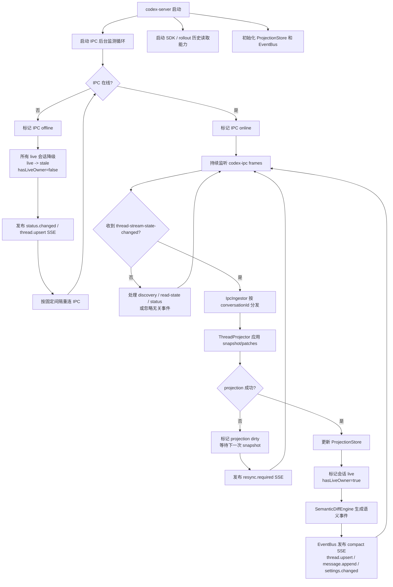
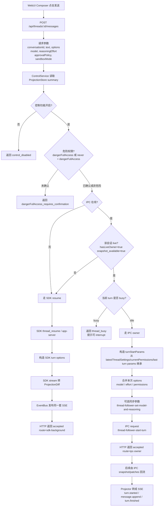

# Codex Remote WebUI SSE 重设计方案

日期：2026-06-09

状态：设计草案，待审核

## 背景

原 `server/` 和 `webui/` 已移动到 `ref/`，新版本按全新结构设计。

结合 `CODEX_WEBUI_DESIGN.md` 的流程目标，以及 `CODEX_IPC_DATA_ANALYSIS.md` 对 IPC 捕获的结论，新架构调整为：

- 后端仍然监听 `codex-ipc`，但不把 IPC 原始 `snapshot/patches` 直接推给 Web。
- 后端先在内存中应用 IPC snapshot/patches，渲染成稳定的会话投影。
- 后端只通过 SSE 向前端发送小粒度语义事件，避免 3MB 级 IPC 全量同步穿透到浏览器。
- 前端通过 HTTP 拉取列表和详情，通过 SSE 接收实时增量，通过 HTTP POST 发起控制操作。

## 设计目标

1. IPC 原始消息只在服务端消化，不直接同步给浏览器。
2. 前端收到的是业务语义事件，例如 `thread.upsert`、`message.append`、`turn.completed`、`settings.changed`。
3. 大对象只走 HTTP 按需加载，例如完整历史、旧消息分页、raw debug。
4. SSE 单向推送负责实时 UI 更新，控制命令继续使用 HTTP POST。
5. 服务端支持 Last-Event-ID 恢复，短线重连不丢关键事件。
6. 保留原设计中的 live/stale/history-only 路由模型。
7. 为后续支持插件访问 owner、参数修改、强制终止、SDK fallback 留好边界。

## 非目标

- 不在前端实现 IPC patch apply。
- 不把 `conversationState` 原样发给前端。
- 不让浏览器直接连接 `\\.\pipe\codex-ipc`。
- MVP 不做完整 Codex App 复刻，只做远程观察、续聊、参数控制和中断。
- MVP 不做复杂多租户权限，先按本机/可信远程 token 模型设计。

## 架构总览

```text
Codex App / VSCode owner
  -> codex-ipc
      raw snapshot/patches, request/response, discovery

codex-server
  -> IpcTransport
  -> IpcIngestor
  -> ThreadProjector
       apply raw snapshot/patches
       normalize turns/items/settings/runtime
       compute semantic diffs
  -> ProjectionStore
       thread summary/detail/message index
       live/stale/history-only state
  -> EventBus + SSEBroker
       compact semantic event stream
  -> HTTP API
       list/detail/control/history/raw debug

codex-webui
  -> HTTP bootstrap and control
  -> EventSource SSE
  -> local normalized store
  -> thread list/detail/composer/settings UI
```

关键原则：IPC 是服务端内部数据源；SSE 是 Web 端稳定事件协议。

## IPC 捕获结论对设计的影响

从已分析样本得到以下约束：

- 新会话和继续会话本质都是 `turns.N` add，只是新会话通常 `baseRevision=0` 且 `N=0`。
- assistant 流式文本不是 delta，而是 `turns.N.items.M.text` 的完整 replace。
- 参数修改会重复广播相近的 `latestThreadSettings/latestCollaborationMode` patch，第二次可能补齐 `developer_instructions`。
- 插件访问 owner 的场景里，继续会话可能从已有 snapshot 开始，并直接追加后续 turn。
- 插件继续 owner 会话时，权限可能从 `on-request/workspaceWrite` 变成 `never/dangerFullAccess`，必须在控制层做确认。
- 强制终止的可靠判断是当前 turn `status=interrupted`，不是单独看 `threadRuntimeStatus=idle`。
- 捕获中通常看不到主动 request body，只能看到 owner 执行后的状态广播，因此服务端必须以状态结果为准更新 UI。

对应设计：

- 后端必须保存每个 conversation 的完整服务端投影，才能把 IPC full replace 转换为小 delta。
- 文本事件优先发送 append delta；只有非前缀变化才发送 replace。
- 参数事件要去重和收敛，不按 patch 条数统计用户操作。
- 权限变化要在 `settings.changed` 和 summary 中显式呈现。

## 后端模块

### 1. `IpcTransport`

职责：

- 连接 Windows named pipe `\\.\pipe\codex-ipc`。
- 发送 `initialize`。
- 读写 4 字节 little-endian length-prefixed JSON frame。
- 自动响应 `client-discovery-request`，默认 `canHandle=false`。
- 提供 `request(method, params)` 给控制服务使用。
- 检测断线并重连。

输出只给 `IpcIngestor`，不直接进入 SSE。

建议状态：

```python
class IpcConnectionStatus:
    online: bool
    client_id: str | None
    connected_at: float | None
    last_seen_at: float | None
    last_error: str | None
```

### 2. `IpcIngestor`

职责：

- 接收 `IpcTransport` 读到的 raw message。
- 过滤非会话事件。
- 将 `thread-stream-state-changed` 按 `conversationId` 投递给 `ThreadProjector`。
- 将 `thread-read-state-changed` 转换为已读状态事件。
- 将 IPC 在线/离线状态投递给 `ProjectionStore`。

不做 Web 事件拼装，只做 raw IPC 到内部领域输入的转换。

### 3. `ThreadProjector`

职责：

- 对每个 conversation 维护 `revision` 和 `raw_state`。
- 遇到 `snapshot` 直接替换 raw state。
- 遇到 `patches` 按顺序 apply 到 raw state。
- 从 raw state 生成 `ThreadProjection`。
- 对比上一次 projection，输出 `ProjectionDiff`。

关键能力：

- revision 连续性检查。
- patch apply 失败时标记 dirty，等待下一次 snapshot 修复。
- 对大 snapshot 做内存更新，不向 SSE 转发 raw。
- 对文本 replace 做 delta 化：
  - 新文本以旧文本为前缀：输出 `message.append`。
  - 否则输出 `message.replace`。

### 4. `ProjectionStore`

职责：

- 保存所有线程 summary。
- 保存 live 线程的最新 projection。
- 保存已打开线程的 message detail cache。
- 合并 SDK/rollout 历史和 IPC live 状态。
- 在 IPC 断线时将 live 降级为 stale。

核心模型：

```python
class ThreadSummary:
    conversation_id: str
    title: str | None
    cwd: str | None
    source: Literal["live", "stale", "history-only"]
    owner_source_client_id: str | None
    has_live_owner: bool
    runtime_status: Literal["idle", "active", "unknown"]
    latest_turn_status: Literal["inProgress", "completed", "interrupted", "failed", "unknown"]
    latest_model: str | None
    latest_reasoning_effort: str | None
    approval_policy: str | None
    sandbox_type: str | None
    latest_preview: str | None
    updated_at: float | None
    active_at: float | None
    token_total: int | None

class ThreadProjection:
    summary: ThreadSummary
    turns: list[TurnProjection]
    messages_by_id: dict[str, MessageProjection]
    settings: ThreadSettings
    raw_revision: int | None
    rollout_path: str | None

class MessageProjection:
    id: str
    conversation_id: str
    turn_id: str | None
    role: Literal["user", "assistant", "reasoning", "tool", "command", "system"]
    phase: str | None
    text: str
    status: str | None
    created_at: float | None
    updated_at: float | None
    ordinal: int
```

### 5. `SemanticDiffEngine`

职责：

- 将 projection diff 转成稳定 SSE 事件。
- 合并短时间内重复事件。
- 去重重复 settings patch。
- 把 thread list 需要的 summary 变化和 detail 需要的 message 变化拆开。

典型输入：

```text
raw patch:
  replace turns.1.items.1.text = "我是 Codex..."

projection diff:
  message msg_x text old -> new

semantic event:
  message.append delta=" 的编程协作代理"
```

### 6. `EventBus`

职责：

- 接收所有语义事件。
- 分配全局递增 `eventId`。
- 写入内存 ring buffer。
- 按 topic 分发给 SSE 连接。

事件 topic：

```text
global
thread:{conversationId}
status
debug
```

建议 ring buffer：

```text
global: 最近 1000 条
每个 thread: 最近 1000 条
status: 最近 100 条
```

超过 buffer 或 Last-Event-ID 太旧时，前端需要重新 HTTP 拉取详情。

### 7. `SSEBroker`

职责：

- 暴露 SSE endpoint。
- 支持 heartbeat。
- 支持 Last-Event-ID。
- 支持按 conversation 过滤。
- 断开连接自动清理 subscriber。

推荐 endpoint：

```text
GET /api/events
GET /api/threads/{conversationId}/events
```

SSE 格式：

```text
id: 1024
event: message.append
data: {"conversationId":"019e...","messageId":"msg_x","delta":"...","textVersion":4}

```

心跳：

```text
event: ping
data: {"time":1780990000}

```

### 8. `HistoryService`

职责：

- 使用 SDKReader 和 RolloutReader 提供完整历史。
- 列表页只加载 summary。
- 打开线程时再加载 detail。
- 支持旧消息分页。
- 将历史消息归一化为与 live projection 同一套 `MessageProjection`。

优先级：

1. live projection。
2. SDK detail。
3. rolloutPath 指定文件。
4. 本地 sessions 搜索 fallback。

### 9. `ControlService`

职责：

- 处理发送消息、修改参数、中断。
- 决定走 IPC owner 还是 SDK resume。
- 发送前做权限确认。
- 控制请求结果通过 HTTP response 返回；后续流式状态通过 SSE 返回。

路由策略：

```text
if ipc.online and summary.has_live_owner and snapshot_available:
    route = ipc-owner
else:
    route = sdk-background
```

IPC owner 控制方法：

```text
thread-follower-start-turn
thread-follower-set-model-and-reasoning
```

强制中断方法需要继续实测确认。HTTP API 先预留：

```text
POST /api/threads/{conversationId}/interrupt
```

## SSE 事件协议

所有事件都有统一 envelope：

```json
{
  "type": "message.append",
  "eventId": 1024,
  "time": 1780990000.123,
  "conversationId": "019e...",
  "payload": {}
}
```

SSE 的 `event:` 与 JSON `type` 保持一致，方便调试。

### `status.changed`

```json
{
  "type": "status.changed",
  "payload": {
    "ipc": {
      "online": true,
      "clientId": "server-client-id",
      "lastError": null
    },
    "sdk": {
      "available": true
    }
  }
}
```

### `thread.upsert`

用于更新线程列表的单个 item。

```json
{
  "type": "thread.upsert",
  "conversationId": "019e...",
  "payload": {
    "summary": {
      "conversationId": "019e...",
      "title": "打招呼",
      "cwd": "D:\\project\\codex-remote",
      "source": "live",
      "runtimeStatus": "active",
      "latestTurnStatus": "inProgress",
      "latestModel": "gpt-5.5",
      "latestReasoningEffort": "high",
      "approvalPolicy": "never",
      "sandboxType": "dangerFullAccess",
      "latestPreview": "我是 Codex...",
      "activeAt": 1780994925.673
    }
  }
}
```

### `thread.snapshot`

正常 IPC 回放过程中不通过 SSE 推送 `thread.snapshot`。打开线程时，前端调用
`GET /api/threads/{conversationId}` 获取归一化 detail；之后 SSE 只发送 compact semantic event。
当 Last-Event-ID 过旧、revision 断裂或 projection 无法继续应用 patch 时，服务端发送
`resync.required`，前端再通过 HTTP 重新拉取 detail。

`thread.snapshot` 仅作为兼容/调试事件预留；即使使用，也必须是归一化快照，不能包含 IPC raw
`conversationState`。

```json
{
  "type": "thread.snapshot",
  "conversationId": "019e...",
  "payload": {
    "summary": {},
    "messages": [],
    "settings": {},
    "reason": "initial_or_recover"
  }
}
```

### `turn.started`

```json
{
  "type": "turn.started",
  "conversationId": "019e...",
  "payload": {
    "turnId": "019e...",
    "turnIndex": 1,
    "status": "inProgress",
    "startedAt": 1780994925.673
  }
}
```

### `message.upsert`

仅用于新增消息 bubble。旧消息不会因为 IPC 再次同步、`updatedAt` 刷新、turn 状态改变而重新
发送整条 `message.upsert`。

```json
{
  "type": "message.upsert",
  "conversationId": "019e...",
  "payload": {
    "message": {
      "id": "msg_x",
      "turnId": "019e...",
      "role": "assistant",
      "phase": "final_answer",
      "text": "",
      "status": "streaming",
      "ordinal": 3
    }
  }
}
```

### `message.patch`

用于已有消息的轻量元数据变化，例如 `status`、`turnId`、`phase`、`ordinal`。payload 不携带完整
`text`；文本增长使用 `message.append`，非前缀文本变化才使用 `message.replace`。

```json
{
  "type": "message.patch",
  "conversationId": "019e...",
  "payload": {
    "messageId": "msg_x",
    "changes": {
      "status": "completed",
      "updatedAt": 1780994930.203
    }
  }
}
```

### `message.append`

文本前缀增长时发送，只传 delta。

```json
{
  "type": "message.append",
  "conversationId": "019e...",
  "payload": {
    "messageId": "msg_x",
    "delta": "编程协作代理。",
    "textVersion": 5
  }
}
```

### `message.replace`

非前缀变化时发送完整文本。该事件应少见。

```json
{
  "type": "message.replace",
  "conversationId": "019e...",
  "payload": {
    "messageId": "msg_x",
    "text": "完整新文本",
    "textVersion": 6
  }
}
```

### `turn.finished`

```json
{
  "type": "turn.finished",
  "conversationId": "019e...",
  "payload": {
    "turnId": "019e...",
    "status": "completed",
    "durationMs": 14102
  }
}
```

中断时：

```json
{
  "type": "turn.finished",
  "conversationId": "019e...",
  "payload": {
    "turnId": "019e...",
    "status": "interrupted",
    "durationMs": 12061
  }
}
```

### `settings.changed`

```json
{
  "type": "settings.changed",
  "conversationId": "019e...",
  "payload": {
    "model": "gpt-5.4",
    "reasoningEffort": "high",
    "approvalPolicy": "never",
    "sandboxType": "dangerFullAccess",
    "previousModel": "gpt-5.5"
  }
}
```

### `token.changed`

```json
{
  "type": "token.changed",
  "conversationId": "019e...",
  "payload": {
    "totalTokens": 28226,
    "lastTokens": 14102,
    "modelContextWindow": 258400
  }
}
```

### `resync.required`

当 Last-Event-ID 太旧、revision 断裂或 projection 无法应用 patch 时发送。

```json
{
  "type": "resync.required",
  "conversationId": "019e...",
  "payload": {
    "reason": "event_buffer_miss"
  }
}
```

前端收到后重新调用 `GET /api/threads/{conversationId}`。

## HTTP API

### `GET /api/status`

返回后端和 IPC/SDK 状态。

### `GET /api/threads`

查询线程列表。

参数：

```text
limit
cursor
source=live|stale|history-only|all
cwd
q
```

返回 compact summary，不含 messages。

### `GET /api/threads/{conversationId}`

打开线程详情。返回归一化 summary、settings、messages。

参数：

```text
messageLimit
before
includeRaw=false
```

### `GET /api/threads/{conversationId}/messages`

旧消息分页。

### `GET /api/events`

全局 SSE：

- status
- thread list upsert
- 当前活跃线程的轻量更新
- resync required

### `GET /api/threads/{conversationId}/events`

单线程 SSE：

- message events
- turn events
- settings/token events

### `POST /api/threads/{conversationId}/messages`

请求：

```json
{
  "text": "继续分析一下",
  "options": {
    "model": "gpt-5.5",
    "reasoningEffort": "high",
    "approvalPolicy": "never",
    "sandboxMode": "danger-full-access"
  },
  "confirmDangerFullAccess": false
}
```

返回：

```json
{
  "ok": true,
  "requestId": "server-request-id",
  "route": "ipc-owner"
}
```

如果缺少危险权限确认：

```json
{
  "ok": false,
  "error": "dangerFullAccess_requires_confirmation",
  "message": "This action uses never + dangerFullAccess and requires confirmation."
}
```

### `POST /api/threads/{conversationId}/settings`

修改模型、思考深度、权限策略。服务端同步到 owner，并等待后续 SSE `settings.changed` 作为最终 UI 状态。

### `POST /api/threads/{conversationId}/interrupt`

中断当前 turn。MVP 可以先只对 live owner 启用。

### `GET /api/debug/ipc/{conversationId}`

本机 debug 模式才开放，返回最近 raw IPC 摘要，不默认启用。

## 统一路由流程图

这部分沿用第一版设计里的核心思路，但改成新版 SSE/projection 术语。

### IPC 监测与会话状态



设计要点：

- IPC 断线时不要删除会话，只降级为 `stale`。
- IPC 恢复后，只有重新收到 snapshot/patches 的 conversation 才升级为 `live`。
- 前端不感知 IPC revision，只接收 server projection 后的语义事件。
- projection 失败不把 raw patch 推给前端，而是让前端重新 HTTP 拉取详情。

### 统一消息发送



设计要点：

- WebUI 永远只调用统一 HTTP 接口，不直接决定 IPC 或 SDK。
- `POST /messages` 成功只表示请求被接受，真实消息流以 SSE 为准。
- live owner 会话优先走 IPC，这样 Codex App / VSCode UI 能同步。
- stale/history-only 会话走 SDK resume。
- busy live 线程不自动 fallback 到 SDK，避免同一会话并发跑两个 turn。

### 路由决策表

| IPC 状态 | 会话状态 | 当前 turn | 发送方式 | 说明 |
| --- | --- | --- | --- | --- |
| offline | 任意 | 任意 | SDK resume | IPC 不可用，只能后台续聊。 |
| online | history-only | idle | SDK resume | 没有 live owner，不走 IPC。 |
| online | stale | idle | SDK resume | 曾经 live，但当前 owner 不确定。 |
| online | live + owner | idle/completed | IPC owner | 首选路径，App/VSCode 同步。 |
| online | live + owner | inProgress | 拒绝或 interrupt/steer | MVP 先返回 `thread_busy`。 |
| online 后断线 | 原 live | 任意 | 降级 stale | 清空 `hasLiveOwner`，发布 SSE。 |
| online 恢复 | 收到 snapshot/patches | 任意 | 升级 live | 重新允许 IPC owner。 |

## 前端设计

技术栈：

- React + Vite + TypeScript。
- EventSource 连接 SSE。
- 本地轻量 store，可用 Zustand 或 React reducer。
- Markdown 渲染使用 `react-markdown` + `remark-gfm`。
- 代码高亮可后置，MVP 可先用普通 code block。
- 图标使用 `lucide-react`。

### 视觉方向：仿 Codex App 工作台

前端整体按 Codex App 的桌面工作台样式实现，而不是传统管理后台或聊天网页。

参考截图中的关键特征：

- 左侧固定浅灰侧栏，包含主导航、项目分组、线程列表、设置入口。
- 主内容区白底，大面积留白，对话内容居中偏窄显示。
- 顶部是轻量 thread header，只显示标题和少量操作。
- 用户消息为右侧浅灰圆角气泡。
- assistant 消息为左侧/正文流式文本，不使用重卡片。
- composer 浮在底部中间，宽圆角输入框，左侧附件/权限，右侧模型/推理深度/发送按钮。
- 整体边框非常浅，阴影克制，图标小而轻。
- 不做营销式 hero、不做装饰渐变、不做多彩卡片。

推荐布局尺寸：

```text
AppShell
  Sidebar: 296px fixed
  Main: remaining width

Main
  Header: 48px
  MessageViewport: calc(100vh - 48px)
  Composer: fixed bottom 10px, width min(740px, calc(100vw - sidebar - 96px))
```

颜色和质感：

```text
page background: #ffffff
sidebar background: #f4f5f8
sidebar active row: #e8e9ef
border: #e6e7eb
muted text: #777b85
primary text: #1f2328
user bubble: #f1f2f4
composer border: #dedfe4
danger permission: #ff4d2e
send button: #8e8e93 normal, #111827 active
```

组件风格：

- 侧栏 row 高度约 32px，8px 左右圆角。
- thread item 标题单行省略，右侧显示相对时间。
- 项目分组标题使用 folder 图标和项目名。
- 选中线程只用浅灰背景，不用彩色边框。
- 消息区最大宽度约 740px，左侧 assistant 文本与右侧 user bubble 在同一阅读列内。
- assistant 消息下方可放复制、重新生成、跳转等小图标按钮，默认低对比。
- composer 高度可随输入增长，但最大不超过视口 35%，超出内部滚动。
- 权限状态用小图标 + 文本，例如 `完全访问`，危险态用橙红色。
- 模型和 reasoning effort 放在 composer 右侧，用紧凑文本或小下拉。

移动端或窄屏：

- 侧栏折叠为抽屉。
- composer 宽度为 `calc(100vw - 24px)`。
- header 保留返回/线程标题/更多菜单。
- 消息列左右边距收窄，但仍保持 user 右对齐、assistant 左对齐。

### 页面布局

```text
TopBar
  IPC status / SDK status / token / settings

Main
  ThreadSidebar
    filters
    cwd groups
    thread rows

  ThreadPane
    Header
      title / cwd / live badge / model / effort / permission
    MessageList
      virtualized messages
    Composer
      text input / send / interrupt / model / effort / permission
```

设计风格：

- 偏工作台，不做 landing page。
- 信息密度高，便于扫描。
- 状态和权限清晰，但不堆装饰性卡片。
- `dangerFullAccess` 和 `approvalPolicy=never` 必须显眼。

### 前端数据流

启动：

```text
1. GET /api/status
2. GET /api/threads
3. 打开 /api/events 全局 SSE
4. 渲染线程列表
```

打开线程：

```text
1. GET /api/threads/{conversationId}
2. 建立 /api/threads/{conversationId}/events
3. 用 HTTP snapshot 初始化本地 detail store
4. 用 SSE 事件持续更新 message/settings/status
```

发送消息：

```text
1. 前端检查本地 summary 是否 busy。
2. 如果危险权限，弹确认。
3. POST /messages。
4. POST 成功后不乐观伪造 assistant 输出，只等待 SSE。
5. 如果一段时间没有收到 turn.started，显示 pending 状态。
```

SSE 重连：

```text
1. EventSource 自动重连。
2. 浏览器带 Last-Event-ID。
3. 服务端能 replay 则补事件。
4. 不能 replay 时发 resync.required。
5. 前端重新 GET 当前线程详情。
```

### 前端 store

```ts
type AppState = {
  status: ServerStatus;
  threadsById: Record<string, ThreadSummary>;
  threadOrder: string[];
  selectedConversationId: string | null;
  detailsById: Record<string, ThreadDetailState>;
};

type ThreadDetailState = {
  summary: ThreadSummary;
  settings: ThreadSettings;
  messagesById: Record<string, Message>;
  messageOrder: string[];
  sseConnected: boolean;
  needsResync: boolean;
};
```

事件处理规则：

- `thread.upsert` 更新列表和当前详情 header。
- 打开线程和 `resync.required` 后通过 HTTP detail 初始化/替换该线程 detail。
- `thread.snapshot` 仅作为兼容/调试事件，收到时替换该线程 detail。
- `message.upsert` 只插入新 message。
- `message.patch` 更新已有 message 的轻量元数据，不携带完整文本。
- `message.append` 只拼接 delta，并校验 `textVersion`。
- `message.replace` 覆盖文本。
- `turn.finished` 更新 composer 可用状态。
- `settings.changed` 更新 header、composer 默认值和权限提示。
- `resync.required` 标记并重新拉取详情。

## 服务端减流策略

### 1. Raw IPC 永不直推

IPC snapshot 可能包含完整 turns、developer instructions、token usage、rolloutPath 等大对象。服务端只保留和归一化，不通过 SSE 发送。

### 2. 文本 full replace 转 delta

IPC 反复发完整文本：

```text
"我是 Codex"
"我是 Codex，基于 GPT-5"
"我是 Codex，基于 GPT-5 的编程协作代理。"
```

SSE 只发：

```text
"我是 Codex"
"，基于 GPT-5"
" 的编程协作代理。"
```

### 3. Summary 与 detail 分离

全局 SSE 不发送消息正文，只发送 summary 和 selected thread 必要事件。线程详情事件只发给订阅该 conversation 的连接。

### 4. Settings 去重

连续 patch 中 settings 内容等价时不发事件；只在归一化后的 `{model, effort, approvalPolicy, sandboxType}` 变化时发送。

### 5. 合并高频事件

建议 50ms 到 100ms 微批：

- 同一 message 多次 append 合并为一个 delta。
- 同一 thread summary 多次变化合并为最新 summary。
- token usage 可延迟到 turn idle 或 500ms 节流。

### 6. 大历史按需 HTTP

旧消息、raw、rollout 只通过 HTTP 分页读取，不进入 SSE。

## 安全设计

默认本机开发：

- 只监听 `127.0.0.1`。
- 控制功能可由环境变量开启：

```text
CODEX_REMOTE_ENABLE_CONTROL=1
```

远程访问：

- 必须启用 token。
- SSE 使用 cookie 或 query token；优先 cookie，避免 URL 泄漏。
- 所有 POST 都要求 token。
- 审计日志记录：
  - conversationId
  - action
  - route
  - cwd
  - model
  - reasoningEffort
  - approvalPolicy
  - sandboxType
  - result

危险权限：

- `sandboxType=dangerFullAccess` 必须二次确认。
- `approvalPolicy=never` + `dangerFullAccess` 显示高风险提示。
- 服务端不信任前端确认之外的状态，最终仍以 `confirmDangerFullAccess=true` 为准。

## 推荐目录结构

```text
codex-remote/
  docs/
    CODEX_WEBUI_SSE_REDESIGN.md
  server/
    pyproject.toml
    codex_server/
      __init__.py
      main.py
      config.py
      models.py
      ipc/
        __init__.py
        transport.py
        ingestor.py
        patcher.py
      projection/
        __init__.py
        projector.py
        store.py
        diff.py
        normalizer.py
      events/
        __init__.py
        bus.py
        sse.py
        schemas.py
      history/
        __init__.py
        sdk_reader.py
        rollout_reader.py
      control/
        __init__.py
        service.py
        routing.py
        audit.py
      tests/
        fixtures/
          ipc-data/
        test_projector.py
        test_sse_replay.py
  webui/
    package.json
    index.html
    src/
      main.tsx
      App.tsx
      api/
        client.ts
        sse.ts
      store/
        appStore.ts
        eventReducer.ts
      components/
        TopBar.tsx
        ThreadSidebar.tsx
        ThreadPane.tsx
        MessageList.tsx
        MessageItem.tsx
        Composer.tsx
        SettingsPanel.tsx
      styles.css
```

## MVP 实现顺序

1. 后端 `models.py`：定义 summary、message、settings、SSE event schema。
2. 后端 `ipc/patcher.py`：实现 JSON patch apply，先用 `ipc-data` fixtures 测。
3. 后端 `projection/projector.py`：把 raw state 转成 projection。
4. 后端 `projection/diff.py`：实现 message append/replace、settings 去重、turn 状态事件。
5. 后端 `events/bus.py` 和 `events/sse.py`：实现 SSE、heartbeat、Last-Event-ID、ring buffer。
6. 后端 `main.py`：实现 `GET /status`、`GET /threads`、`GET /threads/{id}`、SSE endpoints。
7. 前端基础壳：TopBar、ThreadSidebar、ThreadPane、EventSource 连接。
8. 前端事件 reducer：支持 thread/message/settings/turn/token/resync。
9. 后端 `ControlService`：实现 send message 和 settings change。
10. 接入 SDKReader/RolloutReader 作为 history-only fallback。
11. 增加 interrupt、审计日志、token。

## 测试策略

### 后端 projector fixture 测试

直接回放 `ipc-data/*.jsonl`：

- 新会话：应输出 `turn.started`、`message.upsert`、`message.append`、`turn.finished completed`。
- 继续会话：应追加 `turns.N`，summary activeAt 更新。
- 参数修改：应输出去重后的 `settings.changed`。
- 强制终止：应输出 `turn.finished interrupted`。
- 插件访问 owner：应识别权限从 `workspaceWrite/on-request` 变为 `dangerFullAccess/never`。

### 减流测试

对比输入 IPC size 和输出 SSE size：

```text
raw IPC snapshot: 3MB
semantic SSE burst: < 20KB
message streaming: 只发新增 delta
```

### SSE 重连测试

- Last-Event-ID 在 buffer 内：补发缺失事件。
- Last-Event-ID 超出 buffer：发送 `resync.required`。
- 服务端重启：前端重新 HTTP bootstrap。

### 前端测试

- Event reducer 单测。
- 大消息 append 性能测试。
- busy/completed/interrupted 状态切换。
- dangerFullAccess 二次确认。

## 待确认问题

1. `thread-follower-interrupt` 或等价中断 IPC 方法需要继续捕获确认。
2. SDK resume 的参数能力是否能覆盖 model、reasoningEffort、sandbox、approval。
3. remote token 是走 cookie 还是 query 参数；推荐 cookie。
4. 是否需要单个 SSE 连接承载所有事件，还是 global + selected thread 双连接。MVP 推荐双连接，逻辑更清晰。
5. raw debug 是否只允许本机模式，避免远程泄漏 developer instructions。

## 最终建议

新版本不要再让前端理解 IPC。后端应该成为唯一的协议适配层：

```text
IPC raw state -> server projection -> semantic SSE -> WebUI store
```

这样可以同时解决三个问题：

- 大幅减少传输量。
- 屏蔽 Codex IPC 状态结构的频繁变化。
- 让 WebUI 更接近稳定产品接口，而不是 IPC 调试器。
